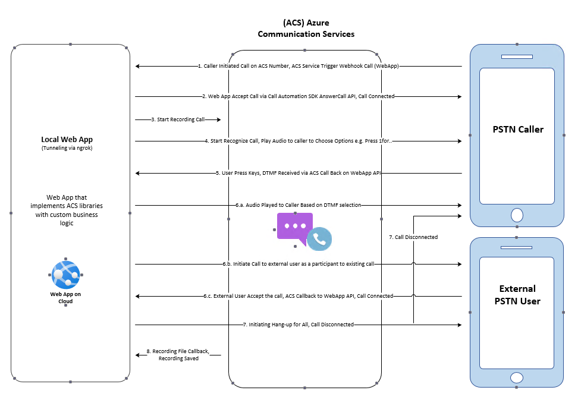

# Call Automation - Simple IVR Solution

This sample application shows how the Azure Communication Services - Call Automation SDK can be used to build IVR related solutions.  
This sample makes an outbound call to a phone number performs dtmf recognition and the application plays next audio based on the key pressed by the callee.      
This sample application configured for accepting tone-1  through tone-5 , If the callee pressed any other key than expected, an invalid audio tone will be played and then call will be disconnected.  

The application is an app service application built on java.  

# Design

### Prerequisites

- Create an Azure account with an active subscription. For details, see [Create an account for free](https://azure.microsoft.com/free/)
- [Java Development Kit (JDK) version 11 or above](https://docs.microsoft.com/azure/developer/java/fundamentals/java-jdk-install)
- [Apache Maven](https://maven.apache.org/download.cgi)
- Create an Azure Communication Services resource. For details, see [Create an Azure Communication Resource](https://docs.microsoft.com/azure/communication-services/quickstarts/create-communication-resource). You'll need to record your resource **connection string** for this sample.
- Get a phone number for your new Azure Communication Services resource. For details, see [Get a phone number](https://learn.microsoft.com/en-us/azure/communication-services/quickstarts/telephony/get-phone-number?tabs=windows&pivots=programming-language-java)
- Download and install [Ngrok](https://www.ngrok.com/download). As the sample is run locally, Ngrok will enable the receiving of all the events.
- (Optional) Create Azure Speech resource for generating custom message to be played by application. Follow [here](https://docs.microsoft.com/azure/cognitive-services/speech-service/overview#try-the-speech-service-for-free) to create the resource.

> Note: the samples make use of the Microsoft Cognitive Services Speech SDK. By downloading the Microsoft Cognitive Services Speech SDK, you acknowledge its license, see [Speech SDK license agreement](https://aka.ms/csspeech/license201809).

## Before running the sample for the first time

1. Open an instance of PowerShell, Windows Terminal, Command Prompt or equivalent and navigate to the directory that you'd like to clone the sample to.
2. git clone https://github.com/Azure-Samples/Communication-Services-java-quickstarts.git.
3. Navigate to CallAutomation_SimpleIvr, look for the file at /src/main/java/com/communication/simpleivr/SimpleIvr.java and update below configurations.
	- connectionString: Replace <resource_connection_string> with Azure Communication Service resource's connection string.
	- applicationPhoneNumber : Replace <phone_number_acquired_as_prerequisite> with Azure Communication Service acquired phone number.
	- callbackBaseUri : Replace <public_url_generated_by_ngrok> with URI of the deployed app service or ngrok url.
	- phoneNumberToAddToCall : Replace <phone_number_to_add_to_call> with target phone number to add as participant.

### Create Webhook for Microsoft.Communication.IncomingCall event and Microsoft.Communication.RecordingFileStatusUpdated event
IncomingCall is an Azure Event Grid event for notifying incoming calls to your Communication Services resource. To learn more about it, see [this guide](https://learn.microsoft.com/en-us/azure/communication-services/concepts/call-automation/incoming-call-notification). 
1. Navigate to your resource on Azure portal and select `Events` from the left side menu.
1. Select `+ Event Subscription` to create a new subscription. 
1. Filter for Incoming Call event. 
1. Choose endpoint type as web hook and provide the public url generated for your application by ngrok. Make sure to provide the exact api route that you programmed to receive the event previously. In this case, it would be <ngrok_url>/api/incomingCall.  

1. Select create to start the creation of subscription and validation of your endpoint as mentioned previously. The subscription is ready when the provisioning status is marked as succeeded. 
1. Follow the Above steps to create Webhook for RecordingFileStatusUpdated event.

This subscription currently has no filters and hence all incoming calls will be sent to your application. To filter for specific phone number or a communication user, use the Filters tab.

### Run the Application

- Navigate to the directory containing the pom.xml file and use the following mvn commands:
	- Compile the application: mvn compile
	- Build the package: mvn package
	- Execute the app: mvn exec:java
